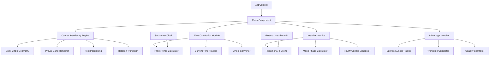

# Design Document: Semi-Circular Prayer Clock Redesign

## Overview

This design transforms the existing circular 24-hour prayer clock into a semi-circular display where only 12 hours are visible at a time, with the circle center positioned at the bottom of the screen and the current time always displayed at the top center. The clock rotates continuously to maintain the current time at the top position, creating an intuitive visualization of time progression throughout the day. The design incorporates enhanced features including weather integration with hourly updates, intelligent background dimming based on sunrise/sunset transitions, and improved visual hierarchy with Arabic prayer names and dual calendar displays (Hijri and Gregorian).

The semi-circular approach optimizes screen real estate while maintaining all existing functionality including prayer time bands, alarm indicators, and night fraction markers (midnight, 1/3, 2/3). The radius calculation adapts to screen orientation by fitting to the shorter dimension, ensuring the clock remains fully visible on both portrait and landscape displays.

## Architecture



## Main Workflow

```mermaid
sequenceDiagram
    participant User
    participant Clock
    participant Canvas
    participant TimeCalc
    participant Weather
    participant Dimming
    
    User->>Clock: View Clock
    Clock->>TimeCalc: Get current time & prayer times
    TimeCalc-->>Clock: Time data + angles
    Clock->>Weather: Check if hourly update needed
    Weather->>Weather: Fetch weather/moon phase
    Weather-->>Clock: Weather data
    Clock->>Dimming: Calculate dimming level
    Dimming-->>Clock: Opacity value
    Clock->>Canvas: Render semi-circle
    Canvas->>Canvas: Calculate rotation angle
    Canvas->>Canvas: Draw prayer bands (180°)
    Canvas->>Canvas: Draw time labels (12 hours)
    Canvas->>Canvas: Rotate to current time at top
    Canvas->>Canvas: Draw current time at bottom
    Canvas->>Canvas: Draw prayer name in Arabic
    Canvas->>Canvas: Draw dates (Hijri/Gregorian)
    Canvas->>Canvas: Draw weather/moon phase
    Canvas-->>User: Display updated clock


## Correctness Properties

*A property is a characteristic or behavior that should hold true across all valid executions of a system—essentially, a formal statement about what the system should do. Properties serve as the bridge between human-readable specifications and machine-verifiable correctness guarantees.*

### Property 1: Semi-Circular Arc Geometry

*For any* clock rendering state, the displayed arc SHALL span exactly 180 degrees and contain exactly 12 hour labels evenly distributed at 15-degree intervals.

**Validates: Requirements 1.1, 1.3, 9.1**

### Property 2: Center Positioning Invariant

*For any* screen dimensions, the circle center SHALL be positioned at the bottom edge of the screen, and all visual elements SHALL remain within the semi-circular boundary above this center point.

**Validates: Requirements 1.2, 1.5**

### Property 3: Adaptive Radius Calculation

*For any* screen dimensions, the radius SHALL be calculated based on the shorter dimension (width for portrait, height for landscape), ensuring the full semi-circle fits within the visible screen area.

**Validates: Requirements 1.4, 10.1, 10.2, 10.3**

### Property 4: Current Time Top-Center Positioning

*For any* current time value, the rotation angle SHALL position that time at the top center of the display (90 degrees in semi-circle coordinates), and this positioning SHALL be maintained continuously as time advances.

**Validates: Requirements 2.1, 2.3**

### Property 5: Uniform Rotation Transform

*For any* rotation angle, all clock elements (prayer bands, hour labels, night fraction markers, alarm indicators) SHALL have the same rotation transformation applied, maintaining their relative positions.

**Validates: Requirements 2.2, 7.5**

### Property 6: Prayer Band Visibility and Clipping

*For any* prayer time period, the prayer band SHALL be drawn if any portion falls within the visible 180-degree range, and SHALL be clipped at the 0-degree and 180-degree boundaries when extending beyond the visible arc.

**Validates: Requirements 3.1, 3.2**

### Property 7: Current Prayer Band Highlighting

*For any* clock state, the current prayer band SHALL have greater width and opacity than non-current prayer bands, and the Arabic prayer name for the current prayer SHALL be displayed.

**Validates: Requirements 3.3, 3.4, 3.5**

### Property 8: Weather Data Display Persistence

*For any* clock rendering state with available weather data, the temperature, weather condition description, and moon phase SHALL be displayed on the clock face, and SHALL persist when weather service fetch operations fail.

**Validates: Requirements 4.3, 4.4, 4.5, 4.6**

### Property 9: Sunrise-Sunset Based Dimming

*For any* current time, location, and date, the background opacity SHALL be reduced when time is between sunset and sunrise, SHALL be at full opacity when time is between sunrise and sunset, and SHALL transition smoothly during the 30-minute periods after sunset and before sunrise.

**Validates: Requirements 5.2, 5.3, 5.4, 5.5**

### Property 10: Dual Calendar Display

*For any* date, both the Gregorian date and Hijri date SHALL be displayed on the clock face in readable positions that remain accessible after rotation is applied.

**Validates: Requirements 6.1, 6.2, 6.3**

### Property 11: Night Fraction Marker Labeling

*For any* clock state, night fraction markers SHALL be drawn at midnight (labeled "1/2"), one-third night (labeled "1/3"), and two-thirds night (labeled "2/3") positions when these positions fall within the visible 180-degree range.

**Validates: Requirements 7.1, 7.2, 7.3, 7.4**

### Property 12: Alarm Indicator Positioning and Color Coding

*For any* set of active alarms matching the current day's frequency requirements, alarm indicators SHALL be displayed at their scheduled time positions within the visible range, with regular alarms colored red and nafl alarms colored yellowgreen.

**Validates: Requirements 8.1, 8.2, 8.3, 8.4, 8.5**

### Property 13: Hour Label Formatting and Positioning

*For any* clock state, hour labels SHALL be formatted in 12-hour format with AM/PM indicators, positioned at the outer edge of the clock arc at a consistent radius, and rotated to remain upright and readable.

**Validates: Requirements 9.2, 9.3, 9.4**

### Property 14: Proportional Element Scaling

*For any* radius value, all visual elements (bands, labels, markers, indicators) SHALL scale proportionally, maintaining consistent relative sizes and spacing.

**Validates: Requirements 10.5**

### Property 15: Prayer Countdown Display

*For any* clock state, the elapsed time since the current prayer and the countdown to the next prayer SHALL be displayed.

**Validates: Requirements 11.5**

### Property 16: Visual Hierarchy Consistency

*For any* clock state, font sizes SHALL follow a consistent hierarchy (current time > prayer name > dates > other text), colors SHALL match the defined color scheme, and text contrast SHALL meet minimum readability ratios against all backgrounds.

**Validates: Requirements 12.1, 12.2, 12.3**

### Property 17: Non-Overlapping Information Placement

*For any* clock state, the Arabic prayer name SHALL be positioned prominently in the center area, and weather data and moon phase information SHALL be positioned in locations that do not overlap with critical elements (current time, prayer name, prayer bands).

**Validates: Requirements 12.4, 12.5**
